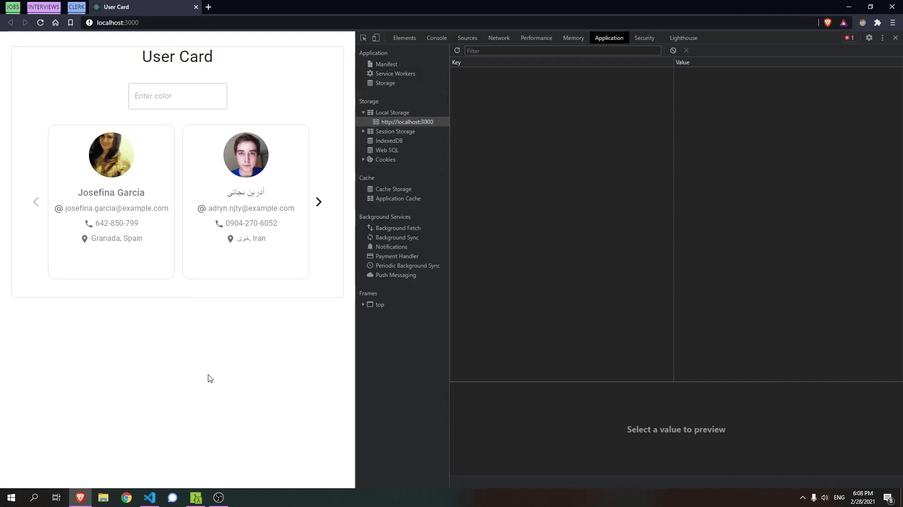
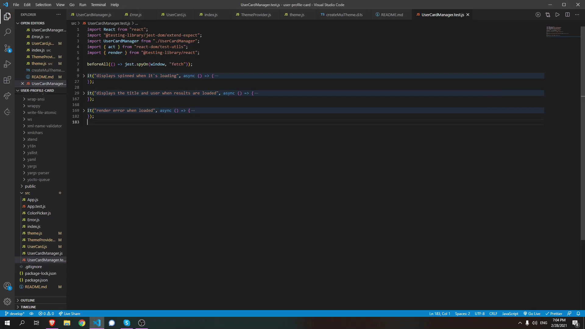

# User Profile Card

## How to install and run

1. Download the example [or clone the repo](https://github.com/Zabzuki/user-profile-card.git)

2. `npm install`
3. `npm start`
4. Ready to use!

## Description

user-profile-card displays users that are fetched from [Randomuser.me API](https://randomuser.me/) in a responsive and friendly way even for mobile devices. There is also added a `<TextField>` where you add HEX code or typing the color and it is applied in the background of the `UserCard`. This value (color) is stored in Local Storage so when you refresh the page, the selected background color will be still the same.


## Technologies

1. ReactJS
2. Material-UI

## Architecture

The app consists of three main components.

1. `UserCardManager` is the main parent component that is fetching batched users from random user API and returns 20 users. The new API call will get place -4 users before the end of the array.
2. `UserCard` displays the user informations (full name, email, phone, location).
3. `ColorPicker` is a text field that updates the background color based on the input value. This value also persists across sessions by saving the value in the local storage.

## Fetch data

The fetch method is in the parent component (`UserCardManager`) and returning 20 users in every call. Their data are passed at the `UserCard` component where used dynamically.

```JavaScript
const fetchUsers = () => {
  fetch("https://randomuser.me/api?results=20")
    .then((res) => res.json())
    .then((body) => {
      setUsers((previousUsers) => {
        return [...previousUsers, ...body.results];
      });
    })
    .catch((error) => {
      setError(true);
    });
};
useEffect(() => {
  fetchUsers();
}, []);
```

it will be recalled -4 users before the end of the fetched users array.

```JavaScript
const [index, setIndex] = useState(0);
const numUsers = users.length;

if (index >= numUsers - 4) {
  fetchUsers();
}
```

If fetch fails, the `<Error />` component will be rendered.


## Background color

The background color can be changed by adding a HEX code or just a color name e.g 'red','purple' in to the `<TextField>`, which is also stored in Local Storage so when the page is refreshed the color will still be the selected one.



In `index.js` the children components are wrapped with `<ThemeProvider>` which is customising the theme content. In `theme.js` is created the `MuiThemeProvider` which is used in `ThemeProvider`.

```JavaScript
let newTheme = {
  ...theme,
  palette: {
    ...theme.palette,
    background: {
      card: color,
    },
  },
};

const setBackgroundColor = (color) => {
  localStorage.setItem("color", color);
  setColor(color);
};

return (
  <ThemeContext.Provider value={setBackgroundColor}>
    <MuiThemeProvider theme={newTheme}>{props.children}</MuiThemeProvider>
  </ThemeContext.Provider>
);
```

with `theme={newTheme}` the color is updated (by changing the default background color). The update procedure take place from the `setBackgroundColor` callback which store value to Local Storage and calls the `setColor`.
By adding React Context in `ThemeProvider.js` the props are available in any component

```JavaScript
const ThemeContext = React.createContext(theme);
```

which are called in `ColorPicker.js` where the `setBackgroundColor` method can be easily used in the `onChange`, so when the `TextField` value changed, will be updated in Local Storage also.

## Unit Tests

In this project there are also contained some basic testing files and more specifically the `App.test.js` and `UserCardManager.test.js`.



- `App.test.js`
  - which is a very simple testing file that checks if the `<App>` component renders correctly without crushing.
- `UserCardManager.test.js` file which is testing if the functinality of `UserCardManager` methods are working correctly.

  ```JavaScript
  beforeAll(() => jest.spyOn(window, "fetch"));
  ```

  that's how we keep tracking the fetch process.

  - `<CircularProgress />` testing (spinner):

    ```JavaScript
    data-testid="spinner"
    ```

    that's the id inside the `<CircularProgress />` component which connects the spinner and the testing method

    ```JavaScript
    const { getByTestId } = rendered;
    const spinner = getByTestId("spinner");

    expect(spinner).toBeInTheDocument();
    ```

    after rendering the `UserCardManager`, that's how we use the id inside the method and expect to see spinner in the document.

    ```JavaScript
    Promise.resolve({
      json: () =>
        Promise.resolve({
          results: [],
        }),
    })
    ```

    here an empty array (results) returned, so that we reproduce a mock version of the fetch method for seeing if the spinner works correctly.

  - `<UserCard>` components and the title:

    ```JavaScript
    Promise.resolve({
      json: () =>
        Promise.resolve({
          results: [
            {
              First user (example)
            },
            {
              Second user (example)
            },
          ],
        }),
    })
    ```

    this promise returns an array with two example users.

    ```JavaScript
    const { getByText, getByTestId } = rendered;
    const heading = getByText("User Card");
    const userCard = getByTestId("user");

    expect(heading).toBeInTheDocument();
    expect(userCard).toBeInTheDocument();
    ```

    after rendering the `UserCardManager`, the `getByText` checks the title, the `getByTestId` checks if the user returned correctly and both of them expected `toBeInTheDocument`.

  - `<Error />` component (rendered in case of errors):

    ```JavaScript
    data-testid="error"
    ```

    that's the id inside the `<Error />` component which connects it with the testing method

    ```JavaScript
    return Promise.reject("an error happened");
    ```

    this promise is the result of `mockImplementation` method

    ```JavaScript
    const { getByTestId } = rendered;
    const heading = getByTestId("error");

    expect(heading).toBeInTheDocument();
    ```

    after rendering the `UserCardManager`, the `getByTestId` checks if the error returned correctly and is expected `toBeInTheDocument`.

## Useful Links

- [ReactJS Documentation](https://reactjs.org/docs/create-a-new-react-app.html)

- [Material-UI Documentation](https://material-ui.com/getting-started/installation/)

- [Adding Transitions to a React Carousel with Material-UI](https://levelup.gitconnected.com/adding-transitions-to-a-react-carousel-with-material-ui-b95825653c1b)

- [Using Fetch method](https://developer.mozilla.org/en-US/docs/Web/API/Fetch_API/Using_Fetch)

- [HTML Color Picker](https://www.w3schools.com/colors/colors_picker.asp)

- [Theming Material-UI](https://material-ui.com/customization/theming/)

- [Change root background color with Material-UI theme](https://stackoverflow.com/questions/59145165/change-root-background-color-with-material-ui-theme)

- [Testing Recipes ReactJS Documentation](https://reactjs.org/docs/testing-recipes.html#data-fetching)

- [Running Tests - Create React App](https://create-react-app.dev/docs/running-tests/)

- [About Queries - Testing Library](https://testing-library.com/docs/queries/about/)
